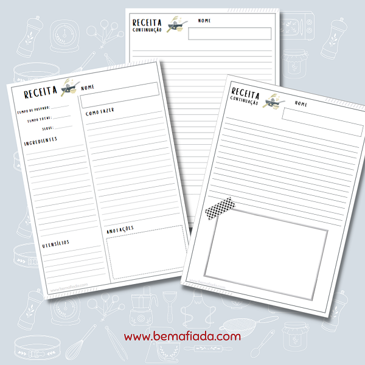

<h1 align="center">
  
</h1>

  

## 💻 Projeto
Aplicativo que dar acesso a algumas das minhas redes sociais.

## 🔃 Requisitos para utilizar

É necessário ter um navegador e internet acessar a aplicação.

## ✨ Tecnologias

-   [ x ] HTML
-   [ x ] CSS

## :hammer_and_wrench: Features 

-   [ ] É possível acessar as minhas redes sociais por essa aplicação.

## 🆚 Versionamento / Versioning

Esse projeto não possui um sistema de versionamento.

## 🆙 Projeto no ar

É possível acessar a aplicação através da URL: https://silasfmartins.github.io/social-tree/ .

## 👨‍💻 Contribuir / Contributing

Deseja contribuir com o projeto? [Passo a passo para contribuir](https://github.com/silasfmartins/social-tree/blob/master/Contributing.md)

## 💿 Histórico / History

Consulte [Releases](https://github.com/silasfmartins/social-tree/releases) para ter um changelog completo.

## 📄 Licença do Projeto/License

Esse projeto está sob a licença MIT. Veja o arquivo [LICENSE](https://github.com/silasfmartins/social-tree/blob/main/LICENSE) © Silas Martins para mais detalhes.

 
